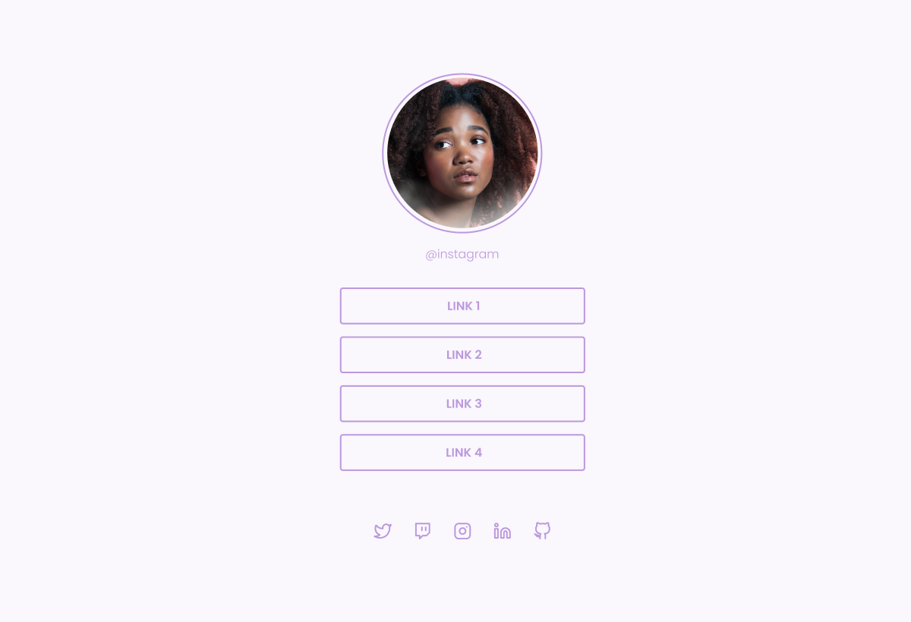
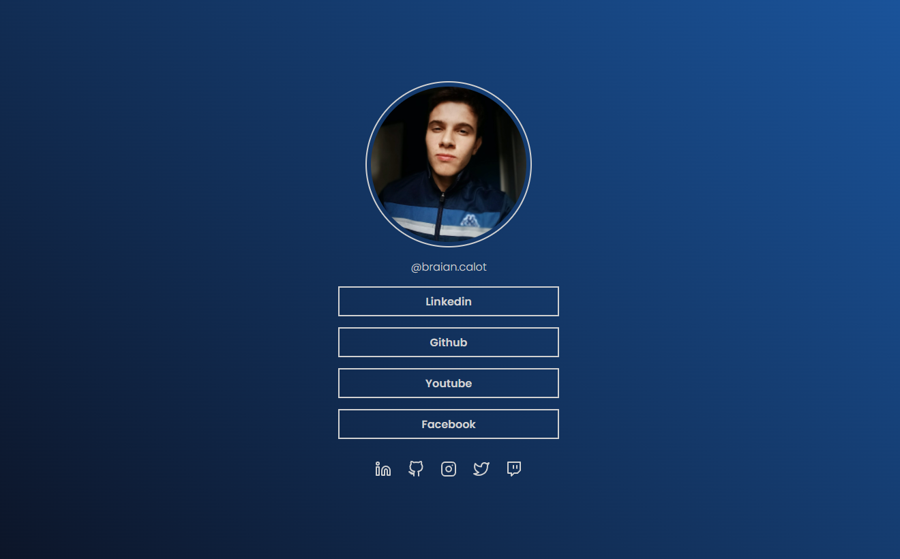

#  Social Tree

## 🎯 Desafio:

Neste desafio, foi proposto a criação de uma página contendo links para suas redes sociais, e o layout a ser seguido foi disponibilizado no  Figma.
 
### Layout disponibilizado

<a href="https://www.figma.com/file/ZwfmeLcsRiJMmy0m6Dwf9U/DD-%2F-Social-links-(Copy)?node-id=0%3A1">Clique aqui para acessar o layout</a> 
 
## 🚀 Resultado: 

<a href="https://social-tree-five.vercel.app">Clique aqui para acessar o site</a> 

## ⚒️ Tecnologias utilizadas:
* HTML
* CSS
